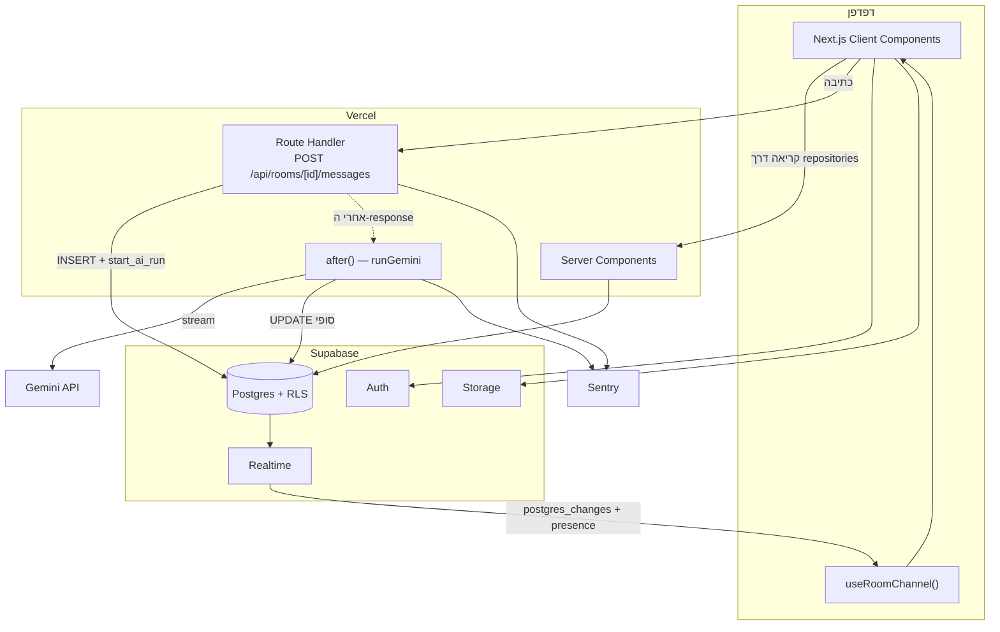
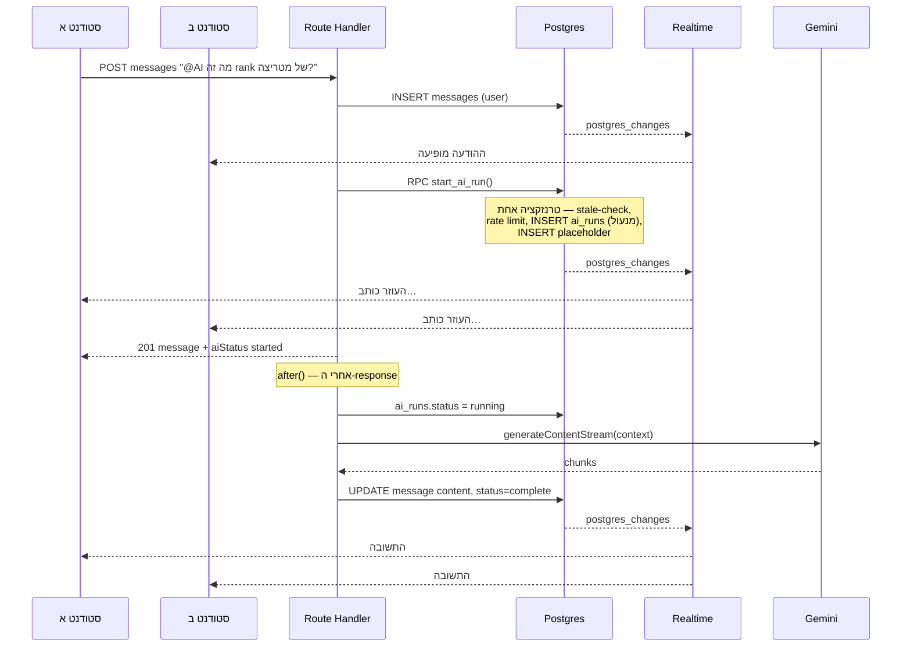
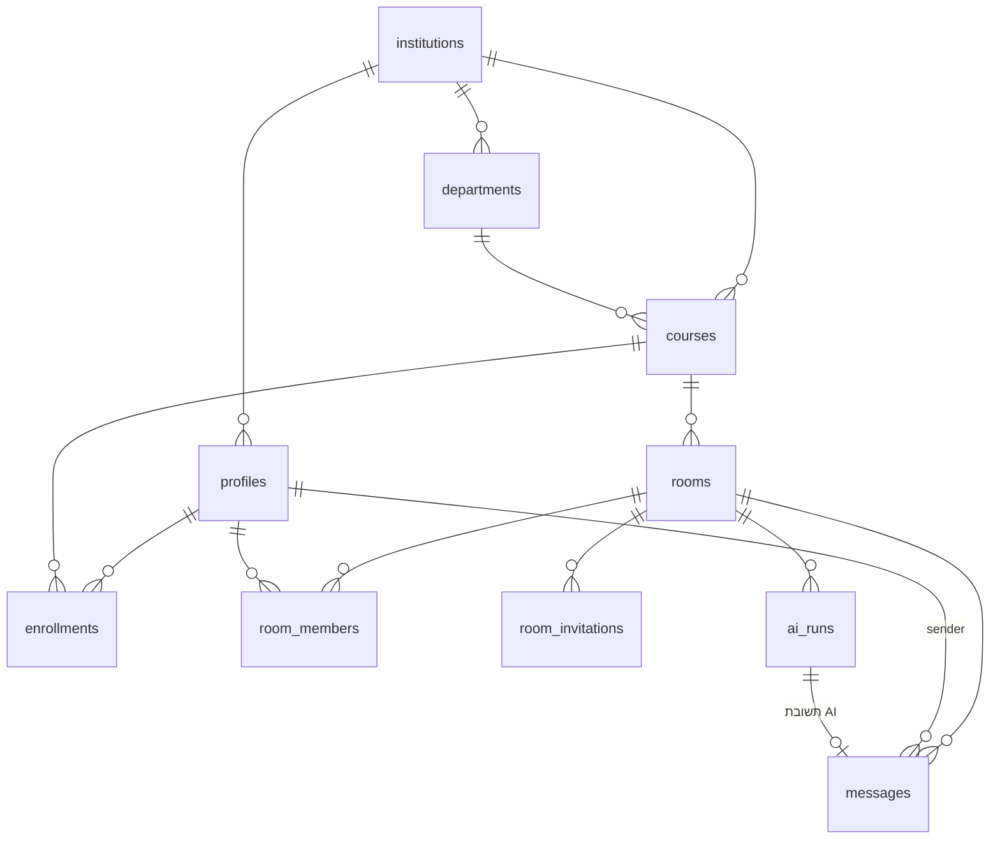

# TECHNICAL SPEC — Stugether

**גרסה:** 1.0 · **תאריך:** 11.09.2026
**נגזר מ-** `SPEC.md`. במקרה של סתירה — `SPEC.md` גובר על המוצר, מסמך זה גובר על המימוש.

---

## 1. Stack

| רכיב                           | בחירה                                     | נימוק                                  |
| ------------------------------ | ----------------------------------------- | -------------------------------------- |
| Frontend                       | Next.js (App Router) + TypeScript         | SSR, Server Components, קרוב ל-Vercel  |
| Styling                        | Tailwind + logical properties             | RTL native ב-Tailwind 3.3+, בלי plugin |
| פונט                           | Heebo דרך `next/font`                     | עברית, self-hosted, בלי CLS            |
| UI                             | shadcn/ui + Radix                         | מהירות פיתוח. דורש RTL audit           |
| DB / Auth / Realtime / Storage | Supabase (Postgres)                       | RLS, Realtime ו-Auth בחבילה אחת        |
| **לוגיקת AI**                  | **Next.js Route Handlers (Node runtime)** | ראה §1.1                               |
| AI                             | Gemini API, streaming                     | מפתח על שם הלקוח                       |
| Hosting                        | Vercel                                    |                                        |
| Errors                         | Sentry (free tier)                        | חובה ל-4 חודשי התחזוקה                 |
| Cron                           | **אין**                                   | ראה §6.4                               |

### 1.1 למה Route Handlers ולא Supabase Edge Functions

ההצעה המקורית כללה Edge Functions. **Trade-off:**

|             | Route Handlers (נבחר)     | Edge Functions            |
| ----------- | ------------------------- | ------------------------- |
| Codebase    | אחד                       | שניים, שתי סביבות runtime |
| לוגים       | Vercel + Sentry, מקום אחד | פיצול בין שני dashboards  |
| סודות       | Vercel env                | Supabase secrets          |
| מסירה ללקוח | deploy אחד להסביר         | שניים                     |

ההכרעה היא **maintainability** — 4 חודשי תחזוקה ומסירה ללקוח שווים יותר מהקרבה ל-DB. הסודות נשארים server-side בשני המקרים.

**מגבלה לוודא ב-M0:** `maxDuration` ב-Vercel Hobby מוגבל ל-60 שניות. מספיק ל-Gemini Flash, אבל צריך לאמת את תוכנית הלקוח.

---

## 2. ארכיטקטורה



### 2.1 זרימת הודעה עם AI



### 2.2 גבולות קוד (נאכפים ב-ESLint)

שלושה גבולות שמאפשרים מעבר עתידי ל-self-hosted בעלות נמוכה (ראה `PHASE3.md`):

| גבול                      | כלל                                                          |
| ------------------------- | ------------------------------------------------------------ |
| `lib/repositories/`       | **אין `supabase.from()` בקומפוננטות.** כל גישה ל-DB דרך repo |
| `hooks/useRoomChannel.ts` | **אין `supabase.channel()` בקומפוננטות**                     |
| `lib/storage/`            | **אין `supabase.storage` בקומפוננטות**                       |

אכיפה: ESLint `no-restricted-imports` על ייבוא ה-Supabase client מתוך `components/` ומתוך `app/**/page.tsx`. בלי הכלל הזה הגבול נשחק תוך שבועיים.

---

## 3. מודל נתונים



### 3.1 קטלוג אקדמי

```sql
institutions (
  id uuid PK, name text NOT NULL, city text,
  is_active boolean DEFAULT true, created_at timestamptz
)

departments (
  id uuid PK, institution_id uuid FK,
  name text NOT NULL, is_active boolean DEFAULT true,
  UNIQUE (institution_id, name)
)

courses (
  id uuid PK,
  institution_id uuid FK, department_id uuid FK,
  code text, name text NOT NULL,
  year_level smallint, semester text,
  is_active boolean DEFAULT true,
  UNIQUE (institution_id, code) WHERE code IS NOT NULL
)
INDEX courses (institution_id, department_id) WHERE is_active
```

### 3.2 משתמשים

```sql
profiles (
  id uuid PK -> auth.users(id) ON DELETE CASCADE,
  full_name text NOT NULL, avatar_url text, bio text,
  institution_id uuid FK, department_id uuid FK, study_year smallint,
  role text NOT NULL DEFAULT 'student'
       CHECK (role IN ('student','super_admin')),
  is_active boolean DEFAULT true,
  last_seen_at timestamptz, created_at, updated_at
)

enrollments (
  id uuid PK,
  user_id   uuid FK -> profiles ON DELETE CASCADE,
  course_id uuid FK -> courses  ON DELETE CASCADE,
  status text DEFAULT 'active' CHECK (status IN ('active','archived')),
  created_at,
  UNIQUE (user_id, course_id)
)
INDEX enrollments (course_id) WHERE status = 'active'
```

`INDEX(course_id)` משרת את מסך "סטודנטים בקורס" ואת בחירת המוזמנים — שתי שאילתות חמות.
הפרופיל נוצר ב-trigger `on_auth_user_created` על `auth.users`.
שינוי `role` נחסם ב-trigger — לא ניתן להעלות את עצמך ל-admin דרך עדכון פרופיל.

### 3.3 חדרים

```sql
rooms (
  id uuid PK,
  course_id  uuid FK NOT NULL,
  created_by uuid FK NOT NULL,
  name text NOT NULL, topic text,
  status text NOT NULL DEFAULT 'active'
         CHECK (status IN ('active','archived','closed')),
  ai_enabled boolean DEFAULT true,
  last_message_at timestamptz,
  created_at, archived_at
)
INDEX rooms (course_id, status)
INDEX rooms (last_message_at DESC NULLS LAST)

room_members (
  room_id uuid FK -> rooms    ON DELETE CASCADE,
  user_id uuid FK -> profiles ON DELETE CASCADE,
  role text NOT NULL DEFAULT 'member' CHECK (role IN ('owner','member')),
  joined_at    timestamptz DEFAULT now(),
  left_at      timestamptz,
  last_read_at timestamptz DEFAULT now(),
  PRIMARY KEY (room_id, user_id)
)
INDEX room_members (user_id) WHERE left_at IS NULL

room_invitations (
  id uuid PK,
  room_id         uuid FK -> rooms ON DELETE CASCADE,
  inviter_id      uuid FK NOT NULL,
  invitee_user_id uuid FK NOT NULL,
  status text NOT NULL DEFAULT 'pending'
         CHECK (status IN ('pending','accepted','declined','expired','revoked')),
  expires_at   timestamptz NOT NULL DEFAULT now() + interval '7 days',
  responded_at timestamptz, created_at,
  UNIQUE (room_id, invitee_user_id) WHERE status = 'pending'
)
INDEX room_invitations (invitee_user_id, status) WHERE status = 'pending'
```

**למה שתי טבלאות ולא אחת:** `room_members` הוא "מי בפנים", `room_invitations` הוא "מי הוזמן". מיזוג לטבלה אחת עם `status='invited'` היה מוסיף תנאי לכל policy על `room_members`, ומאלץ כל שאילתת חברים לזכור לסנן.

**אכיפת 2-4:** לא ניתן לספור שורות ב-`CHECK`. האכיפה ב-RPC — §6.3.

### 3.4 הודעות

```sql
messages (
  id uuid PK DEFAULT gen_random_uuid(),
  room_id     uuid FK -> rooms ON DELETE CASCADE NOT NULL,
  sender_id   uuid FK -> profiles,
  sender_type text NOT NULL CHECK (sender_type IN ('user','ai','system')),
  content     text NOT NULL DEFAULT '',
  status      text NOT NULL DEFAULT 'complete'
              CHECK (status IN ('complete','streaming','failed')),
  ai_run_id   uuid FK -> ai_runs,
  metadata    jsonb DEFAULT '{}',
  created_at  timestamptz DEFAULT now(),
  deleted_at  timestamptz,

  CHECK (sender_type <> 'user' OR sender_id IS NOT NULL),
  CHECK (sender_type <> 'ai'   OR sender_id IS NULL)
)
INDEX messages (room_id, created_at DESC, id DESC) WHERE deleted_at IS NULL
```

- **Keyset pagination** על `(created_at, id)`, לא `OFFSET`. אותו index משרת גם את ספירת ה-unread.
- **Soft delete** — מחיקה קשה הייתה שוברת את הקשר ה-AI ואת רצף השיחה.
- ה-`id` נוצר **בקליינט**, כדי לאפשר optimistic UI ו-dedup מול אירוע ה-realtime.

### 3.5 AI

```sql
ai_runs (
  id uuid PK,
  room_id            uuid FK NOT NULL,
  trigger_message_id uuid FK,
  requested_by       uuid FK NOT NULL,
  status text NOT NULL DEFAULT 'queued'
         CHECK (status IN ('queued','running','succeeded','failed')),
  model text,
  prompt_tokens int, completion_tokens int,
  context_message_count int,
  error_code text, error_message text,
  created_at timestamptz NOT NULL DEFAULT now(),
  started_at timestamptz, finished_at timestamptz
)

-- המנעול: ריצה פעילה אחת לחדר, נאכף ע"י ה-DB
CREATE UNIQUE INDEX ai_runs_one_active_per_room
  ON ai_runs (room_id) WHERE status IN ('queued','running');

INDEX ai_runs (requested_by, created_at DESC)
INDEX ai_runs (created_at DESC) WHERE status = 'failed'

app_settings (
  id smallint PK DEFAULT 1 CHECK (id = 1),
  ai_system_prompt text NOT NULL,
  ai_enabled boolean NOT NULL DEFAULT true,
  updated_at, updated_by uuid FK
)
```

**`created_at` הוא קריטי, לא נוי.** ריצה ב-`queued` עדיין לא התחילה, כלומר `started_at IS NULL`. stale-check שבודק מול `started_at` **לא יתפוס אותה**, והחדר יינעל לצמיתות. הבדיקה רצה מול `created_at` בלבד.

כל שאר הפרמטרים (model, temperature, trigger mode, context window, rate limits) יושבים ב-env ולא ב-DB — ראה `PHASE3.md`.

### 3.6 שלב 2

```sql
conversations (
  id uuid PK,
  user_a_id uuid FK NOT NULL, user_b_id uuid FK NOT NULL,
  last_message_at timestamptz, created_at,
  CHECK (user_a_id < user_b_id),
  UNIQUE (user_a_id, user_b_id)
)

direct_messages (
  id uuid PK, conversation_id uuid FK NOT NULL,
  sender_id uuid FK NOT NULL,
  content text NOT NULL, created_at, deleted_at
)
INDEX direct_messages (conversation_id, created_at DESC, id DESC)

conversation_reads (
  conversation_id uuid FK, user_id uuid FK,
  last_read_at timestamptz DEFAULT now(),
  PRIMARY KEY (conversation_id, user_id)
)

push_subscriptions (
  id uuid PK, user_id uuid FK NOT NULL,
  endpoint text UNIQUE NOT NULL, p256dh text NOT NULL, auth text NOT NULL,
  user_agent text, failed_count int DEFAULT 0,
  created_at, last_used_at, disabled_at
)
```

`CHECK (user_a_id < user_b_id)` נותן ייחודיות של שיחת 1:1 בעמודה אחת — בלי טבלת participants, ו-RLS הופך ל-`auth.uid() IN (user_a_id, user_b_id)`.

### 3.7 Unread — למה `last_read_at` ולא counter

|        | `last_read_at` (נבחר)     | counter ב-DB                   |
| ------ | ------------------------- | ------------------------------ |
| כתיבה  | שורה אחת בכניסה לחדר      | trigger בכל הודעה × כל חבר     |
| נכונות | נגזר מהאמת                | נשבר במחיקה רכה, דורש backfill |
| קריאה  | `COUNT(*)` מול index קיים | `SELECT` אחד                   |

בסדר גודל של אלפי משתמשים ה-`COUNT` זול. כדי למנוע N שאילתות בדשבורד — RPC אחד `get_unread_summary()` שמחזיר את כל החדרים (ובשלב 2 גם השיחות) בקריאה אחת.

---

## 4. אבטחה ו-RLS

### 4.1 עקרונות

1. RLS `ENABLE` + `FORCE` על **כל** הטבלאות. `anon` קורא רק את הקטלוג האקדמי.
2. מפתח Gemini ו-service role key — **server-side בלבד**, לעולם לא `NEXT_PUBLIC_*`.
3. הודעות AI נכתבות **רק** ב-service role. אין מסלול שבו קליינט מייצר `sender_type='ai'`.
4. Super Admin עובד דרך policies, לא דרך service role — כדי שכל פעולה תעבור דרך ה-DB עם זהות אמיתית.

### 4.2 Helper functions

כולן `SECURITY DEFINER STABLE`. **`DEFINER` הוא חובה**: policy על `room_members` שמפנה ל-`room_members` נכנסת ל-infinite recursion.

```sql
is_room_member(p_room_id uuid) -> boolean
  -- חבר פעיל: EXISTS(room_members WHERE user_id = auth.uid() AND left_at IS NULL)
  -- לא בודק את rooms.status

can_post_in_room(p_room_id uuid) -> boolean
  -- is_room_member(p_room_id) AND rooms.status = 'active'

is_super_admin() -> boolean
  -- profiles.role = 'super_admin' AND is_active

is_conversation_participant(p_id uuid) -> boolean   -- שלב 2
```

**הפרדת קריאה מכתיבה היא החלטה מכוונת.** חדר `archived`/`closed` הוא **קריאה בלבד, לא היעלמות**. אילו `is_room_member` הייתה בודקת גם את `status`, ארכוב חדר היה מוחק בפועל את כל הלמידה מהמסך של הסטודנטים.

### 4.3 Policies

| טבלה                                       | פעולה           | תנאי                                                                                  |
| ------------------------------------------ | --------------- | ------------------------------------------------------------------------------------- |
| `institutions` / `departments` / `courses` | SELECT          | `is_active` — פתוח למאומתים                                                           |
|                                            | INSERT / UPDATE | `is_super_admin()`                                                                    |
| `profiles`                                 | SELECT          | `id = auth.uid()` OR `is_super_admin()` OR חולק קורס (פרופיל ציבורי)                  |
|                                            | UPDATE          | `id = auth.uid()`, בלי `role` (נאכף ב-trigger)                                        |
| `enrollments`                              | ALL             | `user_id = auth.uid()` · SELECT גם למי שחולק קורס                                     |
| `rooms`                                    | SELECT          | `is_room_member(id)` OR `is_super_admin()`                                            |
|                                            | INSERT          | `created_by = auth.uid()` AND רשום לקורס                                              |
|                                            | UPDATE          | `owner` בחדר OR `is_super_admin()`                                                    |
| `room_members`                             | SELECT          | `is_room_member(room_id)`                                                             |
|                                            | UPDATE          | `user_id = auth.uid()` — רק `last_read_at`, `left_at`                                 |
| `room_invitations`                         | SELECT          | מזמין OR מוזמן OR `is_room_member(room_id)`                                           |
|                                            | INSERT          | `inviter_id = auth.uid()` AND `is_room_member(room_id)`                               |
|                                            | UPDATE          | דרך RPC בלבד                                                                          |
| **`messages`**                             | **SELECT**      | **`is_room_member(room_id)`** — כולל חדר מאורכב                                       |
|                                            | **INSERT**      | **`can_post_in_room(room_id)` AND `sender_id = auth.uid()` AND `sender_type='user'`** |
|                                            | **UPDATE**      | **אין policy למשתמשים.** service role בלבד                                            |
|                                            | DELETE          | אין. מחיקה רכה דרך RPC                                                                |
| `ai_runs`                                  | SELECT          | `is_room_member(room_id)` OR `is_super_admin()`                                       |
|                                            | INSERT / UPDATE | RPC / service role בלבד                                                               |
| `app_settings`                             | SELECT          | מאומת (צריך לדעת אם ה-AI פעיל)                                                        |
|                                            | UPDATE          | `is_super_admin()`                                                                    |

**אין UPDATE policy למשתמשים על `messages` במכוון.** UPDATE פתוח — גם אם מוגבל לבעלות ולחלון זמן — מאפשר גם לשנות את `content`, בסתירה להנחה "אין עריכת הודעות". מחיקה רכה עוברת ב-RPC ייעודי (§6.5).

### 4.4 Realtime Authorization

Policies על `realtime.messages` כך שרק חבר חדר יכול לעשות `subscribe` ל-`room:{id}`.

**בלי זה ה-Broadcast וה-Presence פתוחים לכל משתמש מחובר שמנחש UUID של חדר.** RLS על הטבלאות אינו מכסה את ערוצי ה-Realtime — זו נקודת כשל נפוצה.

### 4.5 Storage

Bucket `avatars`, policy לפי prefix: משתמש כותב רק תחת `{auth.uid()}/`. קריאה פתוחה למאומתים. מגבלת 2MB ו-mime type נאכפות ב-bucket config **וגם** ב-`lib/storage/`.

---

## 5. Realtime

| Channel                         | תוכן                                                                                      | הרשאה       |
| ------------------------------- | ----------------------------------------------------------------------------------------- | ----------- |
| `room:{roomId}`                 | Presence (מי מחובר) · postgres_changes על `messages` (INSERT/UPDATE) · Broadcast `typing` | חבר חדר     |
| `user:{userId}`                 | הזמנה חדשה, עדכון unread — מזין את הדשבורד                                                | הבעלים בלבד |
| `dm:{conversationId}` _(שלב 2)_ | postgres_changes + typing                                                                 | משתתף בשיחה |

- כל הערוצים **private**.
- postgres_changes מספיק ל-MVP. אם יגיע עומס — מעבר ל-`realtime.broadcast_changes()` מטריגר, **בלי שינוי ב-UI**, כי ה-UI מדבר רק עם `useRoomChannel`.
- **Reconciliation:** ההודעה מתווספת אופטימית עם ה-uuid שנוצר בקליינט. אירוע ה-realtime על אותו uuid מחליף את השורה במקום לשכפל.

---

## 6. תכנון ה-AI

### 6.1 Trigger

`@AI` mention או כפתור "שאל את העוזר". **בלבד.**

| אפשרות                | עלות         | רעש UX           | הוכרע |
| --------------------- | ------------ | ---------------- | ----- |
| **mention בלבד**      | נמוכה וצפויה | אין              | ✅    |
| mention + זיהוי שאלות | ×3-5         | false positives  | ✗     |
| כל הודעה              | ×20+         | AI מתפרץ לכל תור | ✗     |

הלקוח משלם על הטוקנים מיום 1, ו-4 אנשים בשיחה מהירה לא רוצים AI שמגיב לכל שורה. `AI_TRIGGER_MODE` ב-env משאיר את הדלת פתוחה לשינוי בלי כתיבה מחדש.

### 6.2 Route אחד

`POST /api/rooms/[id]/messages` — הקליינט קורא **פעם אחת**, ה-trigger מזוהה בצד השרת.

```
export const maxDuration = 60

סינכרוני (לפני ה-response):
  1. zod validate
  2. INSERT messages — עם ה-client של המשתמש, RLS אוכפת can_post_in_room
  3. אם יש trigger -> RPC start_ai_run(room_id, message_id, user_id, limits)  -- admin client
  4. 201 { message, aiStatus }

אסינכרוני:
  5. after(() => runGemini(runId))
```

`aiStatus` ∈ `'started' | 'busy' | 'rate_limited' | 'disabled' | null`

### 6.3 RPCs

**`start_ai_run(p_room_id, p_trigger_message_id, p_requested_by, p_user_limit_per_hour, p_room_limit_per_hour)` — טרנזקציה אחת, `SECURITY DEFINER`, `EXECUTE` ל-`service_role` בלבד:**

השרת קורא לה עם ה-admin client ומעביר את מגבלות ה-env כפרמטרים. אילו סטודנט יכול היה לקרוא לה ישירות, הוא היה שולח מגבלות משלו.

```sql
1. stale-check:
   UPDATE ai_runs SET status='failed', error_code='stale', finished_at=now()
   WHERE room_id = p_room_id
     AND status IN ('queued','running')
     AND created_at < now() - interval '90 seconds'

2. app_settings.ai_enabled AND rooms.ai_enabled     -> 'disabled'

3. rate limit: COUNT(ai_runs) בשעה האחרונה
   לפי requested_by ולפי room_id                    -> 'rate_limited'

4. INSERT ai_runs (status='queued')      -- 23505   -> 'busy'

5. INSERT messages (sender_type='ai', status='streaming', content='')

6. RETURN { run_id, placeholder_message_id, ai_status }
```

**למה הכל בטרנזקציה אחת:** אם ה-placeholder נכשל אחרי ש-`ai_runs` כבר נכתב, המנעול נשאר תפוס על ריצה שאיש לא יריץ, והחדר חסום עד ה-stale-check הבא. אטומיות מבטלת את המצב הזה לגמרי.

**למה המנעול נרכש לפני ה-response:** אילו כל הלוגיקה הייתה ב-`after()`, ה-`busy` לעולם לא היה מגיע לקליינט ולא היה אפשר להציג "העוזר עונה כרגע".

**`accept_room_invitation(p_invitation_id)` — `SECURITY DEFINER`:**

```sql
1. SELECT ... FROM rooms WHERE id = ... FOR UPDATE      -- נעילת השורה
2. invitation.status = 'pending'?                        -> INVITATION_INVALID
3. invitation.expires_at > now()?
   אחרת: UPDATE status='expired'                         -> INVITATION_EXPIRED
4. COUNT(room_members WHERE left_at IS NULL) < 4?        -> ROOM_FULL
5. INSERT room_members + UPDATE invitation status='accepted'
```

**תוקף בלי cron:** אין job שמסמן הזמנות שפג תוקפן, ולכן התוקף נאכף **בשתי נקודות** — ב-RPC, ובשאילתת "הזמנות ממתינות" שמסננת `status='pending' AND expires_at > now()`. בלי שתיהן, `status='pending'` לבדו משקר.

**`soft_delete_message(p_message_id)` — `SECURITY DEFINER`:**
מאמת `sender_id = auth.uid()` ו-`created_at > now() - interval '5 minutes'`, וכותב `deleted_at` **בלבד**. `content` לא ניתן לשינוי בשום מסלול.

**`get_unread_summary()`** — כל החדרים והשיחות בקריאה אחת.

### 6.4 Concurrency ו-stale — למה אין cron

| בעיה                               | פתרון                                                    |
| ---------------------------------- | -------------------------------------------------------- |
| שני סטודנטים שולחים `@AI` כמעט יחד | המנעול ב-DB. השני מקבל `busy`                            |
| הקשר לא עדכני                      | ההקשר נלקח **ברגע תחילת הריצה**, אחרי שההודעות כבר נכתבו |
| ריצה שקרסה נועלת את החדר           | stale-check lazy בתוך `start_ai_run`                     |

`maxDuration=60` מבטיח שריצה לגיטימית לא חורגת מ-90 שניות, ולכן `created_at` בטוח כקריטריון יחיד.

**Trade-off מודע:** בלי cron, ריצה תקועה משתחררת רק כשמישהו מנסה שוב — לא אוטומטית. מכיוון שהמשתמש שנתקע ינסה שוב תוך שניות, זה מספיק ל-MVP וחוסך תשתית שלמה. cron אמיתי ב-`PHASE3.md`.

### 6.5 ניהול הקשר

```
[system prompt]
[מטא: שם הקורס · נושא החדר · שמות המשתתפים]
[N ההודעות האחרונות — deleted_at IS NULL]
```

- `N` = `AI_CONTEXT_MESSAGES` (ברירת מחדל 30), עם **תקרת tokens קשיחה** `AI_MAX_INPUT_TOKENS` (~8000). התקרה גוברת על `N`.
- **אין סיכום מתגלגל** ב-MVP. שיחה ארוכה מאבדת את ההיסטוריה הרחוקה — מגבלה מקובלת, ראה `PHASE3.md`.

**עלות לחדר — נוסחה, לא מספר:**

```
עלות_לתשובה = (prompt_tokens × מחיר_input) + (completion_tokens × מחיר_output)
```

טיפוסי: ~3-4k input, ~400-600 output. ב-Gemini Flash זה שברירי סנט לתשובה.
**המספר האמיתי נמדד בפועל** דרך `ai_runs.prompt_tokens/completion_tokens` ומוצג בדשבורד האדמין. מחירונים משתנים, המדידה לא.

### 6.6 Streaming

**מומש: placeholder + UPDATE סופי.**

1. שורת ה-placeholder כבר קיימת מ-`start_ai_run` → כולם רואים "העוזר כותב…" דרך postgres_changes
2. השרת צובר את ה-stream מ-Gemini דרך callback **`onChunk`** — כרגע no-op
3. בסיום: `UPDATE` אחד עם הטקסט המלא ו-`status='complete'`

**נקודת השדרוג — לשמור עליה:** ה-`onChunk` קיים בקוד מיום 1. שדרוג ל-chunks ב-Broadcast הוא מילוי ה-callback + subscriber בקליינט. **בלי שינוי בסכמה ובלי שבירת UI** — שורת `status='streaming'` נשארת בדיוק כפי שהיא. כל מימוש שיפר את הגבול הזה מייקר את השדרוג פי כמה.

|               | placeholder + UPDATE (נבחר) | chunks ב-Broadcast         |
| ------------- | --------------------------- | -------------------------- |
| מסלולי נתונים | אחד                         | שניים, דורש reconciliation |
| מצטרף באמצע   | רואה נכון                   | לא רואה עד ה-UPDATE        |
| חוויה         | "כותב…" ואז התשובה          | הקלדה חיה                  |
| שעות          | 1.75                        | +4                         |

### 6.7 טיפול בשגיאות

| כשל                         | טיפול                                                         |
| --------------------------- | ------------------------------------------------------------- |
| Gemini מחזיר שגיאה          | `messages.status='failed'`, טקסט בעברית, `ai_runs.error_code` |
| stream נקטע באמצע           | **הטקסט החלקי נשמר** + "(נקטע)" + `status='failed'`           |
| timeout / crash של הפונקציה | ה-run נשאר `running` → משוחרר ב-stale-check הבא               |
| rate limit                  | `aiStatus='rate_limited'`, הודעה בעברית, ההודעה עצמה נשמרת    |

בכל `failed` מופיע כפתור "נסה שוב". כל כשל נרשם ל-Sentry **וגם** ל-`ai_runs.error_*` — Sentry לדיבאג, ה-DB לדשבורד האדמין.

### 6.8 System prompt (טיוטה)

נשמר ב-`app_settings.ai_system_prompt`, ניתן לעריכה ע"י Super Admin.

```
אתה שותף למידה בחדר לימוד קבוצתי של 2 עד 4 סטודנטים בקורס "{course_name}".
נושא החדר: {room_topic}. המשתתפים: {participant_names}.

- ענה בעברית, אלא אם פנו אליך בבירור בשפה אחרת.
- יש כמה דוברים בשיחה. פנה אליהם בשם כשזה רלוונטי, ושים לב כשהם חלוקים.
- הנחה והסבר. אל תמסור פתרון מלא למטלה מוערכת — עזור להם להגיע אליו.
- ענה קצר. זו שיחה, לא מאמר. אם צריך הרחבה, שאל אם רוצים.
- אם אינך בטוח, אמור זאת. אל תמציא מקורות, נוסחאות או עובדות.
- הישאר בנושא הקורס.
```

---

## 7. Observability

|               |                                                             |
| ------------- | ----------------------------------------------------------- |
| **Sentry**    | client + server. כל exception ב-route handlers וב-`after()` |
| **`ai_runs`** | כל ריצה, כולל טוקנים ושגיאות — מזין את דשבורד האדמין        |
| **לוגים**     | structured, עם `room_id` ו-`run_id` בכל שורה במסלול ה-AI    |

חיוני ל-4 חודשי התחזוקה: כשמגיע דיווח "העוזר לא ענה", צריך להגיע מהחדר לריצה לשגיאה בלי לנחש.

---

## 8. מבנה תיקיות

```
app/
  (auth)/            הרשמה, התחברות
  (app)/             דשבורד, קורסים, חדרים, פרופיל
  admin/             Super Admin
  api/rooms/[id]/messages/route.ts
components/          UI בלבד — אין supabase.from()
lib/
  supabase/          client / server / admin
  repositories/      roomsRepo, messagesRepo, invitationsRepo, coursesRepo…
  ai/                gemini client, context builder, prompt
  storage/           uploadAvatar, getPublicUrl
hooks/
  useRoomChannel.ts  הגבול היחיד מול Realtime
supabase/
  migrations/
  seed.sql
```

---

## 9. Spike ל-Web Push (שלב 2, לפני מימוש)

**מה בודקים:** הרשמה והרשאות · התקנת service worker · התראה כשהטאב סגור · כשהמכשיר נעול · אחרי 24 שעות רדום · endpoint שפג תוקפו (410 → `disabled_at`).

**מכשירים:** iOS Safari (**הקריטי** — דורש PWA + Add to Home Screen, ואין הרשאה בלי user gesture) · Android Chrome · Desktop Chrome / Safari / Firefox.

**הצלחה:** ≥90% מסירה תוך 30 שניות ב-Android ובדסקטופ, **וגם** iOS עובד לפחות במסלול PWA מלא.

**כישלון:** fallback ל-badge בתוך האפליקציה בלבד, ו-Web Push עובר ל-`PHASE3.md` כ-Change Request.

**הספייק קצוב בזמן. לא מתחילים מימוש לפני שהתוצאה ידועה.**

---

## 10. משתני סביבה

```
NEXT_PUBLIC_SUPABASE_URL
NEXT_PUBLIC_SUPABASE_ANON_KEY
SUPABASE_SERVICE_ROLE_KEY        # server בלבד
GEMINI_API_KEY                   # server בלבד
GEMINI_MODEL
AI_TRIGGER_MODE                  # mention
AI_CONTEXT_MESSAGES              # 30
AI_MAX_INPUT_TOKENS              # 8000
AI_MAX_OUTPUT_TOKENS
AI_RATE_LIMIT_USER_PER_HOUR
AI_RATE_LIMIT_ROOM_PER_HOUR
NEXT_PUBLIC_SENTRY_DSN
SENTRY_AUTH_TOKEN
```

`.env.example` מכיל את השמות בלבד, ללא ערכים.

---

## 11. בדיקות אימות

### RLS (M1)

| #   | תרחיש                                                | ציפייה            |
| --- | ---------------------------------------------------- | ----------------- |
| 1   | לא-חבר: `SELECT messages`                            | 0 שורות           |
| 2   | לא-חבר: `subscribe room:{id}`                        | נדחה              |
| 3   | קליינט: `INSERT` עם `sender_type='ai'`               | נדחה              |
| 4   | חבר שעזב (`left_at`): `SELECT messages`              | 0 שורות           |
| 5   | **חבר בחדר `archived`: `SELECT messages`**           | **כל ההיסטוריה**  |
| 6   | **אותו חבר: `INSERT messages`**                      | **נדחה**          |
| 7   | `UPDATE messages` ישיר                               | נדחה — אין policy |
| 8   | `soft_delete_message` על הודעה של אחר / מלפני 10 דק׳ | נדחה              |
| 9   | סטודנט מול policy של אדמין                           | נדחה              |
| 10  | Super Admin: `SELECT messages`                       | 0 שורות (פרטיות)  |

### Concurrency (M3 / M5)

| #   | תרחיש                                             | ציפייה                                         |
| --- | ------------------------------------------------- | ---------------------------------------------- |
| 11  | שני אישורים במקביל לחדר עם 3 חברים                | אחד נכנס, שני `ROOM_FULL`                      |
| 12  | הזמנה עם `expires_at` בעבר                        | לא ב"ממתינות", `accept` → `INVITATION_EXPIRED` |
| 13  | שני `@AI` בפער 100ms                              | ריצה אחת, תשובה אחת, שני `busy`                |
| 14  | `running` מלפני 2 דקות                            | משוחרר, ריצה חדשה נוצרת                        |
| 15  | **`queued` עם `started_at IS NULL` מלפני 2 דקות** | **משוחרר גם הוא**                              |
| 16  | `start_ai_run` נכשלת באמצע                        | אין ריצה פעילה, אין placeholder יתום           |

### אבטחה (M7)

| #   | תרחיש                                             | ציפייה   |
| --- | ------------------------------------------------- | -------- |
| 17  | חיפוש `GEMINI` / `SERVICE_ROLE` ב-`.next/static/` | 0 תוצאות |

---

## 12. מצב המימוש — DB (13.09.2026)

ה-DB של שלב 1 ממומש ב-`supabase/migrations/` ונבדק ב-`supabase/tests/` (39/39). **במקרה של סתירה בין סעיף זה לסעיפים 3-6 — סעיף זה מתאר את הקוד בפועל.**

### 12.1 קבצים

| קובץ                                   | תוכן                                                                                             |
| -------------------------------------- | ------------------------------------------------------------------------------------------------ |
| `20260913000001_catalog_and_users.sql` | קטלוג, `profiles`, `enrollments`, triggers של פרופיל                                             |
| `20260913000002_rooms_messages_ai.sql` | חדרים, חברים, הזמנות, הודעות, `ai_runs`, `app_settings`                                          |
| `20260913000003_helpers_and_rls.sql`   | helpers, RLS, `public_profiles`, Realtime Authorization, Storage, publication                    |
| `20260913000004_rpcs.sql`              | כל ה-RPCs                                                                                        |
| `seed.sql`                             | מוסד, 2 מחלקות, 5 קורסים, 5 סטודנטים, אדמין, חדר פעיל, חדר מאורכב, הזמנה ממתינה והזמנה שפג תוקפה |
| `tests/`                               | `shim.sql` (תאימות Supabase ל-PGlite), `db.mjs`, 5 קבצי בדיקות                                   |

### 12.2 שינויים ותוספות מול הסעיפים הקודמים

| נושא                  | בפועל                                                                                                                                            | למה                                                                  |
| --------------------- | ------------------------------------------------------------------------------------------------------------------------------------------------ | -------------------------------------------------------------------- |
| **פרופיל ציבורי**     | policy על `profiles` מחזירה רק את השורה שלך (או הכל לאדמין). סטודנטים אחרים נקראים דרך view `public_profiles` — שם, תמונה, מוסד, מחלקה, שנה בלבד | policy מחזירה שורה שלמה; אי אפשר להגביל עמודות ב-RLS                 |
| **מי רואה פרופיל**    | `shares_course_with` **או** `shares_room_with`                                                                                                   | שם השולח לא ייעלם מהיסטוריית חדר אחרי שמישהו עזב את הקורס            |
| `profiles.avatar_url` | CHECK: `NULL` או `<own id>/<file>` — נתיב Storage בלבד, לא URL                                                                                   | מונע הפניה לשרת חיצוני שכל חבר לכיתה יטען                            |
| **`rooms`**           | עמודות `archived_by`, `archived_by_admin` (מתוחזקות ב-trigger)                                                                                   | בעל חדר לא יכול לבטל ארכוב שעשה אדמין                                |
| **הודעה מחוקה**       | גלויה רק לשולח. SELECT: `is_room_member AND (deleted_at IS NULL OR sender_id = auth.uid())`                                                      | תוכן שנמחק לא נשאר קריא לשאר החדר                                    |
| **INSERT הודעה**      | דורש `created_at = now()`                                                                                                                        | אי אפשר לזייף סדר הודעות או unread. **הקליינט לא שולח `created_at`** |
| **Realtime**          | `public.messages` נוסף ל-publication `supabase_realtime`                                                                                         | בלי זה postgres_changes לא יורה בכלל                                 |
| **משתמש מושבת**       | `is_active=false` → כל ה-helpers מחזירים false; trigger משחרר את מקומו בחדרים ומעביר בעלות                                                       | משתמש מושבת לא תופס מקום מתוך ה-4                                    |
| **הרשאות טבלה**       | בנוסף ל-RLS, `REVOKE` על כתיבות שלא אמורות לקרות                                                                                                 | כתיבה אסורה נכשלת ב-`42501` במקום להשפיע על 0 שורות                  |
| **Storage**           | גם SELECT על `storage.objects` מוגבל לתיקייה שלך                                                                                                 | אין listing של תיקיות אחרים. התמונות עצמן נטענות מה-public URL       |

### 12.3 Helpers

`is_room_member` · `can_post_in_room` · `is_super_admin` · `shares_course_with` · `shares_room_with` · `is_enrolled_in_course` · `can_invite_to_room` · `has_room_membership_row` · `require_active_caller`

### 12.4 RPCs

| RPC                                                  | נגיש ל-                      | תפקיד                                    |
| ---------------------------------------------------- | ---------------------------- | ---------------------------------------- |
| `start_ai_run`                                       | **service_role בלבד**        | נעילה + placeholder, טרנזקציה אחת        |
| `accept_room_invitation`                             | authenticated                | נעילת חדר, תוקף, קיבולת                  |
| `decline_room_invitation` · `revoke_room_invitation` | authenticated                | מוזמן / מזמין                            |
| `get_pending_invitations`                            | authenticated                | מסונן לפי `expires_at`                   |
| `soft_delete_message`                                | authenticated                | הודעה עצמית, 5 דקות                      |
| `mark_room_read` · `get_unread_summary`              | authenticated                | unread                                   |
| `leave_room` · `remove_room_member`                  | authenticated                | עזיבה / הסרה ע"י owner, כולל העברת בעלות |
| `set_room_status` · `update_room`                    | authenticated                | owner או אדמין                           |
| `admin_room_stats` · `admin_global_stats`            | authenticated (בודקות אדמין) | מספרים בלבד, בלי תוכן הודעות             |

**אין UPDATE ישיר** למשתמשים על `rooms`, `room_members`, `room_invitations`, `messages`. כל שינוי עובר ב-RPC.

### 12.5 מה חייב להשתנות באפליקציה בגלל זה

1. פרופילים של אחרים נקראים מ-`public_profiles`, לא מ-`profiles`.
2. `avatar_url` שומר נתיב (`<id>/avatar-…`) ו-`lib/storage` הופך אותו ל-URL. **`lib/storage/index.ts` מחזיר כרגע URL — צריך לעדכן.**
3. insert של הודעה בלי `created_at`.
4. route ה-AI קורא ל-`start_ai_run` עם `createAdminClient()`, אחרי שאימת את המשתמש.

### 12.6 מה לא נבדק (אין Docker)

- מרוץ אמיתי בין שני חיבורים (#11, #13) — PGlite הוא חיבור אחד; נבדק ברצף + קיום הנעילה
- `supabase db reset` על ה-image האמיתי, והתחברות עם משתמשי ה-seed
- Realtime ו-Storage של Supabase עצמם (נבדקו רק ה-policies)
- ב-Supabase אמיתי `postgres` אינו superuser — פקודות על `realtime`/`storage` עלולות להתנהג אחרת
